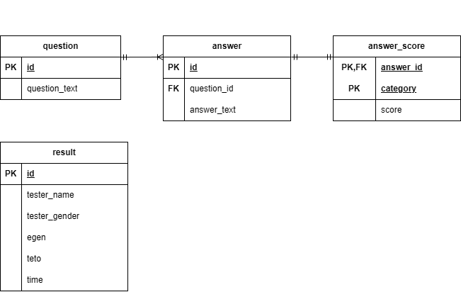

# 에겐력 테토력 테스트

## 프로젝트 소개
설문을 통해 사용자의 성향을 분석하는 웹 서비스

## 주요 기능
- 이름/성별 기반 결과 도출
- 설문 데이터 DB 저장
- 설문 목록 페이지네이션 구현

## ERD

## 기술 스택
- Backend: Spring Boot, JPA
- Frontend: HTML, CSS
- DB: H2
- Build Tool: Gradle